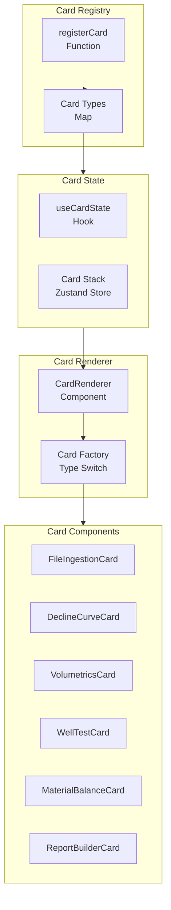

# Card System Documentation

## Overview

The Card System is a core feature of CYSMIC Subsurface OS that allows AI agents to spawn interactive UI components dynamically within the chat interface. Cards are ephemeral - they appear when needed and can be dismissed when done.

## Architecture



## Implementation Files

| File | Purpose |
|------|---------|
| `types.ts` | Card type definitions and schemas |
| `CardRegistry.tsx` | Registration system for card types |
| `CardRenderer.tsx` | Dynamic component rendering |
| `useCardState.ts` | State management hook |

## Card Types

### 1. FileIngestionCard

**Purpose:** Upload and parse petroleum data files

**Supported Formats:**
- LAS (Log ASCII Standard)
- DLIS (Digital Log Interchange Standard)
- CSV (Comma-Separated Values)
- Petrel exports

**Schema:**
```typescript
interface FileIngestionCard {
  type: 'file-ingestion';
  data: {
    acceptedFormats: string[];
    maxSize: number; // MB
    onComplete?: (data: ParsedFile) => void;
  };
}
```

### 2. DeclineCurveCard

**Purpose:** Visualize and analyze production decline curves

**Models Supported:**
- Hyperbolic: `q = qi / (1 + b*Di*t)^(1/b)`
- Exponential: `q = qi * exp(-Di*t)`
- Harmonic: `q = qi / (1 + Di*t)`

**Schema:**
```typescript
interface DeclineCurveCard {
  type: 'decline-curve';
  data: {
    wellId: string;
    productionData: Array<{ time: number; rate: number }>;
    modelType: 'hyperbolic' | 'exponential' | 'harmonic';
    parameters?: {
      qi?: number;
      Di?: number;
      b?: number;
    };
    forecast?: {
      months: number;
      eur: number;
    };
  };
}
```

### 3. VolumetricsCard

**Purpose:** Calculate STOIIP/OOIP with uncertainty

**Formula:**
```
STOIIP = 7758 * A * h * φ * (1-Sw) / Bo
```

**Schema:**
```typescript
interface VolumetricsCard {
  type: 'volumetrics';
  data: {
    area: number;           // acres
    thickness: number;      // ft
    porosity: number;       // fraction
    sw: number;             // water saturation
    bo: number;             // formation volume factor
    distribution?: {
      type: 'monte-carlo' | 'deterministic';
      iterations?: number;
      distributions?: Record<string, Distribution>;
    };
  };
}
```

### 4. WellTestCard

**Purpose:** Pressure transient analysis

**Parameters:**
- Permeability (mD)
- Skin factor
- Reservoir pressure (psi)
- Wellbore storage

**Schema:**
```typescript
interface WellTestCard {
  type: 'well-test';
  data: {
    wellId: string;
    pressureData: Array<{ time: number; pressure: number }>;
    testType: 'buildup' | 'drawdown' | 'falloff';
    analysis?: {
      method: 'horner' | 'miller-dyes-hutchinson';
      permeability?: number;
      skin?: number;
      pRes?: number;
    };
  };
}
```

### 5. MaterialBalanceCard

**Purpose:** Reservoir engineering calculations

**Models:**
- p/Z plot for gas reservoirs
- Cole plot for water influx
- Drive index calculation

**Schema:**
```typescript
interface MaterialBalanceCard {
  type: 'material-balance';
  data: {
    reservoirId: string;
    pvtData: {
      pi: number;      // initial pressure
      piOverZ: number;
      boi: number;    // initial FVF
      bg: number;     // gas FVF
      cw: number;     // water compressibility
      cf: number;     // formation compressibility
    };
    productionData: Array<{
      date: string;
      np: number;     // cumulative oil
      gp: number;     // cumulative gas
      wp: number;     // cumulative water
      bp: number;     // cumulative voidage
    }>;
  };
}
```

### 6. ReportBuilderCard

**Purpose:** Generate professional reports

**Output Formats:**
- PDF
- DOCX
- PPTX

**Schema:**
```typescript
interface ReportBuilderCard {
  type: 'report-builder';
  data: {
    title: string;
    sections: Array<{
      type: 'text' | 'chart' | 'table' | 'image';
      content: any;
    }>;
    exportFormat: 'pdf' | 'docx' | 'pptx';
  };
}
```

## Using the Card System

### Registering a New Card

```typescript
// cards/CardRegistry.tsx
import { registerCard } from './types';

registerCard({
  type: 'my-custom-card',
  name: 'My Custom Card',
  description: 'A custom card component',
  schema: z.object({
    prop1: z.string(),
    prop2: z.number(),
  }),
  component: MyCustomCard,
});
```

### Spawning a Card from Agent

```typescript
// Backend agent response
{
  response: "Here are the results...",
  cards: [
    {
      type: 'decline-curve',
      data: {
        wellId: '123',
        productionData: [...],
        modelType: 'hyperbolic'
      }
    }
  ]
}
```

### Rendering Cards

```tsx
// In React component
import { CardRenderer } from './cards/CardRenderer';

function ChatMessage({ cards }) {
  return (
    <div className="cards-container">
      {cards.map((card) => (
        <CardRenderer key={card.id} card={card} />
      ))}
    </div>
  );
}
```

### Managing Card State

```typescript
import { useCardState } from './cards/useCardState';

function MyComponent() {
  const { 
    cards, 
    addCard, 
    removeCard, 
    updateCard,
    clearCards 
  } = useCardState();

  const handleSpawn = () => {
    addCard({
      type: 'decline-curve',
      data: { ... }
    });
  };

  return <button onClick={handleSpawn}>Add Card</button>;
}
```

## Styling

Cards use TailwindCSS with custom styling:

```css
.card {
  @apply bg-white rounded-lg shadow-lg border border-sandstone-200;
}

.card-header {
  @apply px-4 py-3 border-b border-sandstone-200;
}

.card-content {
  @apply p-4;
}

.card-footer {
  @apply px-4 py-3 border-t border-sandstone-200 bg-sandstone-50;
}
```

## Best Practices

1. **Keep cards focused** - One card per task
2. **Provide defaults** - Include sensible defaults for parameters
3. **Handle loading states** - Show loading spinners during async operations
4. **Error handling** - Display user-friendly error messages
5. **Responsive design** - Cards should work on different screen sizes

## Future Enhancements

- Drag-and-drop card reordering
- Card templates library
- Custom card builder UI
- Card-to-card communication
- Persistent card layouts
